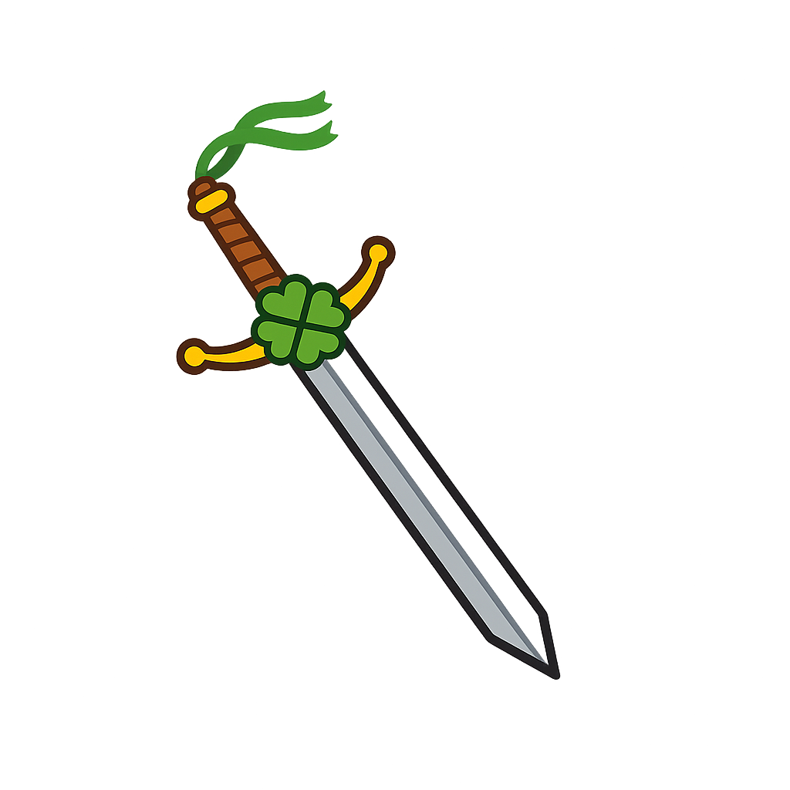
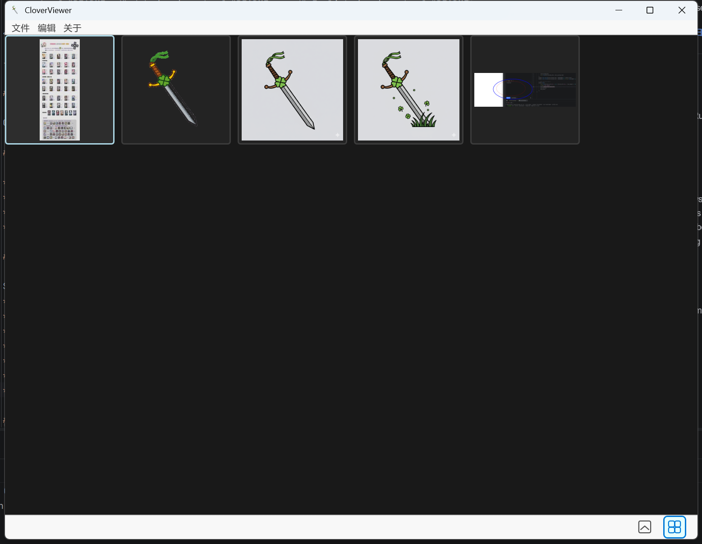
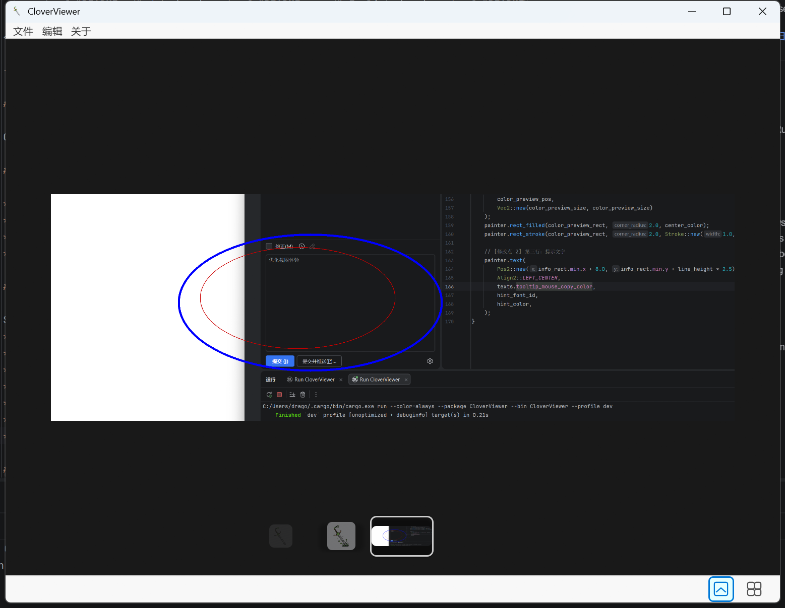
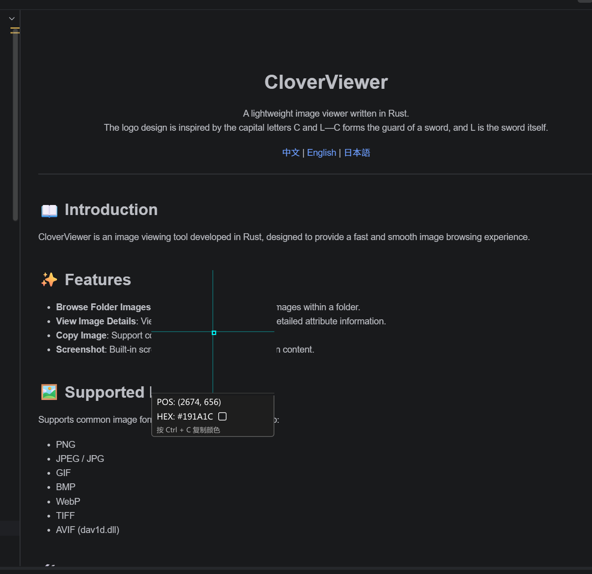
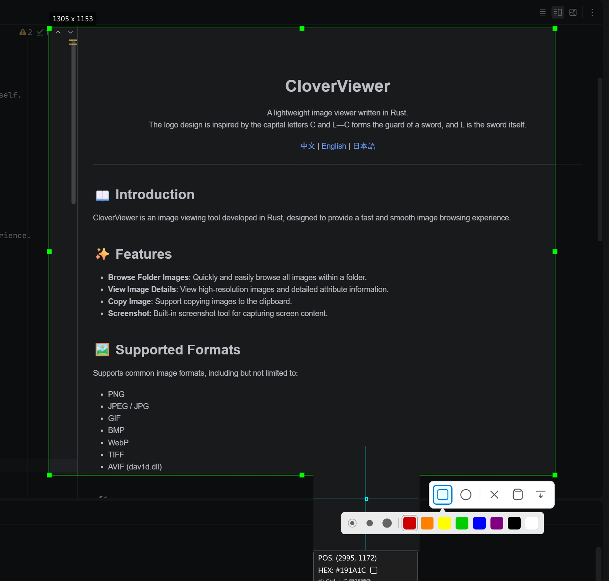

<div align="center">
  
  <h1>CloverViewer Image Viewer & Screenshot Tool</h1>
  <p>
    A lightweight image viewer and screenshot tool written in Rust.<br>
    The logo design is inspired by the capital letters C and L—C forms the guard of a sword, and L is the sword itself.
  </p>
  <p>
    <a href="README.md">中文</a> | <a href="README.en.md">English</a> | <a href="README.ja.md">日本語</a>
  </p>
</div>

---

## 📖 Introduction

CloverViewer is a lightweight tool developed in Rust, combining image browsing and screen capturing capabilities, designed to provide a fast and smooth user experience.

## ✨ Features

*   **Browse Folder Images**: Quickly and easily browse all images within a folder.
*   **View Image Details**: View high-resolution images and detailed attribute information.
*   **Copy Image**: Support copying images to the clipboard.
*   **Screenshot**: Built-in screenshot tool for capturing screen content.

## 📸 Screenshots

| Grid Mode | Detail Mode |
| :---: | :---: |
|  |  |
| **Screenshot Mode 1** | **Screenshot Mode 2** |
|  |  |

## 🖼️ Supported Formats

Supports common image formats, including but not limited to:
*   PNG
*   JPEG / JPG
*   GIF
*   BMP
*   WebP
*   TIFF
*   AVIF (dav1d.dll)

## 🛠️ Development Environment Setup

This project depends on the `dav1d` library to support the AVIF image format. For compiling on Windows, it is recommended to use `vcpkg` to manage C/C++ dependencies.

### 1. Install vcpkg and dav1d

Please ensure you have Git installed.

```powershell
# 1. Clone the vcpkg repository (recommended to install at C:\vcpkg, but you can choose a custom path)
git clone https://github.com/microsoft/vcpkg.git C:\vcpkg

# 2. Navigate to the directory and run the bootstrap script
cd C:\vcpkg
.\bootstrap-vcpkg.bat

# 3. Install dav1d (for 64-bit Windows)
.\vcpkg install dav1d:x64-windows
```

### 2. Install pkg-config

You need to install `pkg-config` so that the Rust build script can find system libraries.

It is recommended to use Chocolatey to install `pkgconfiglite`:

> **Tip**: If you don't have Chocolatey installed, run the following command in PowerShell with **administrator privileges**:
> ```powershell
> Set-ExecutionPolicy Bypass -Scope Process -Force; [System.Net.ServicePointManager]::SecurityProtocol = [System.Net.ServicePointManager]::SecurityProtocol -bor 3072; iex ((New-Object System.Net.WebClient).DownloadString('https://community.chocolatey.org/install.ps1'))
> ```

Install pkg-config:
```powershell
choco install pkgconfiglite
```
*Alternatively, you can manually download `pkg-config.exe` and add it to your system's PATH environment variable.*

### 3. Configure Environment Variables

To help the build tools find the library files, you need to configure the following environment variables:

*   **`VCPKG_ROOT`**: Points to your vcpkg installation directory (e.g., `C:\vcpkg`).
*   **`PKG_CONFIG_PATH`**: Points to the pkgconfig directory within vcpkg.
    *   The typical path is: `C:\vcpkg\installed\x64-windows\lib\pkgconfig`

### 4. Build the Project

Once the environment is configured, clean and rebuild the project:

```shell
cargo clean
cargo build
```

## 🤝 Acknowledgements

Special thanks to **Gemini AI** for the valuable assistance provided during the development of this project.

## 📄 License

This project is licensed under the [MIT License](LICENSE).