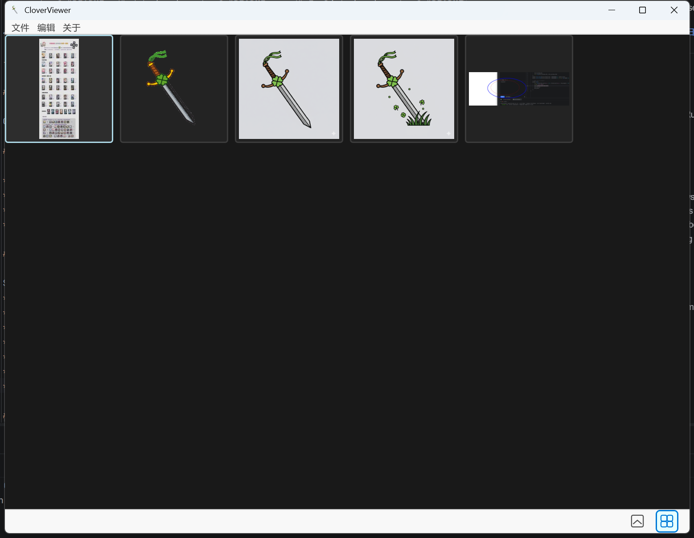
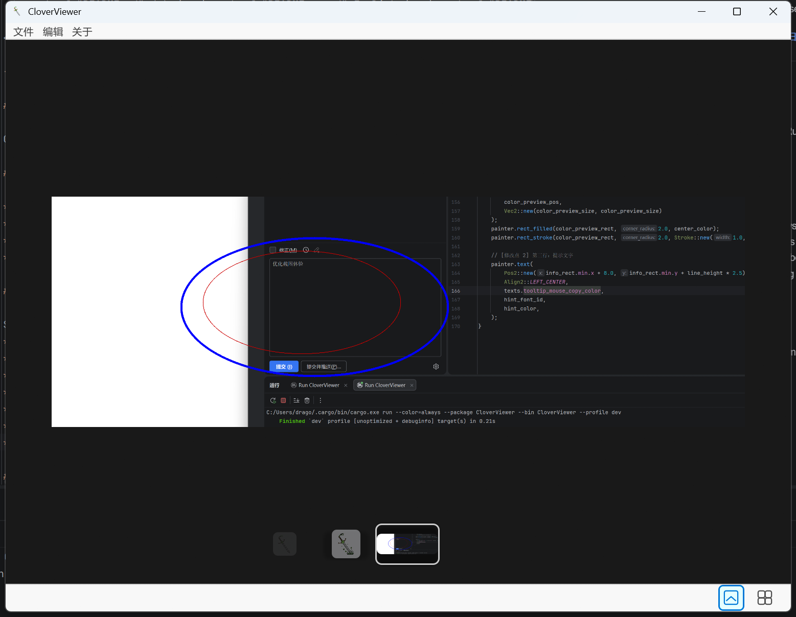
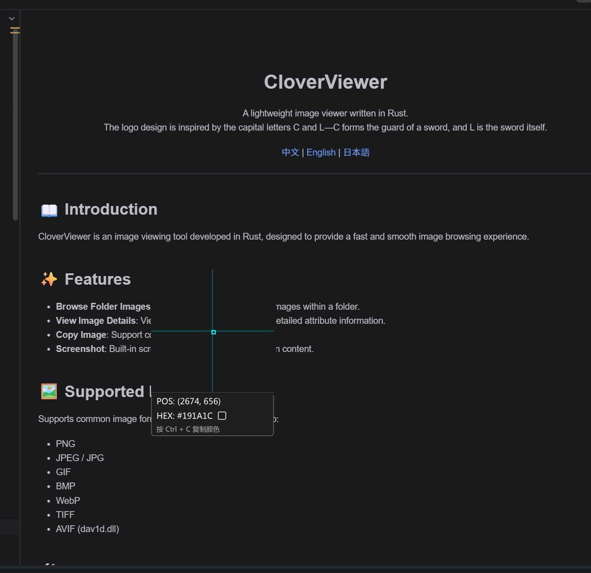
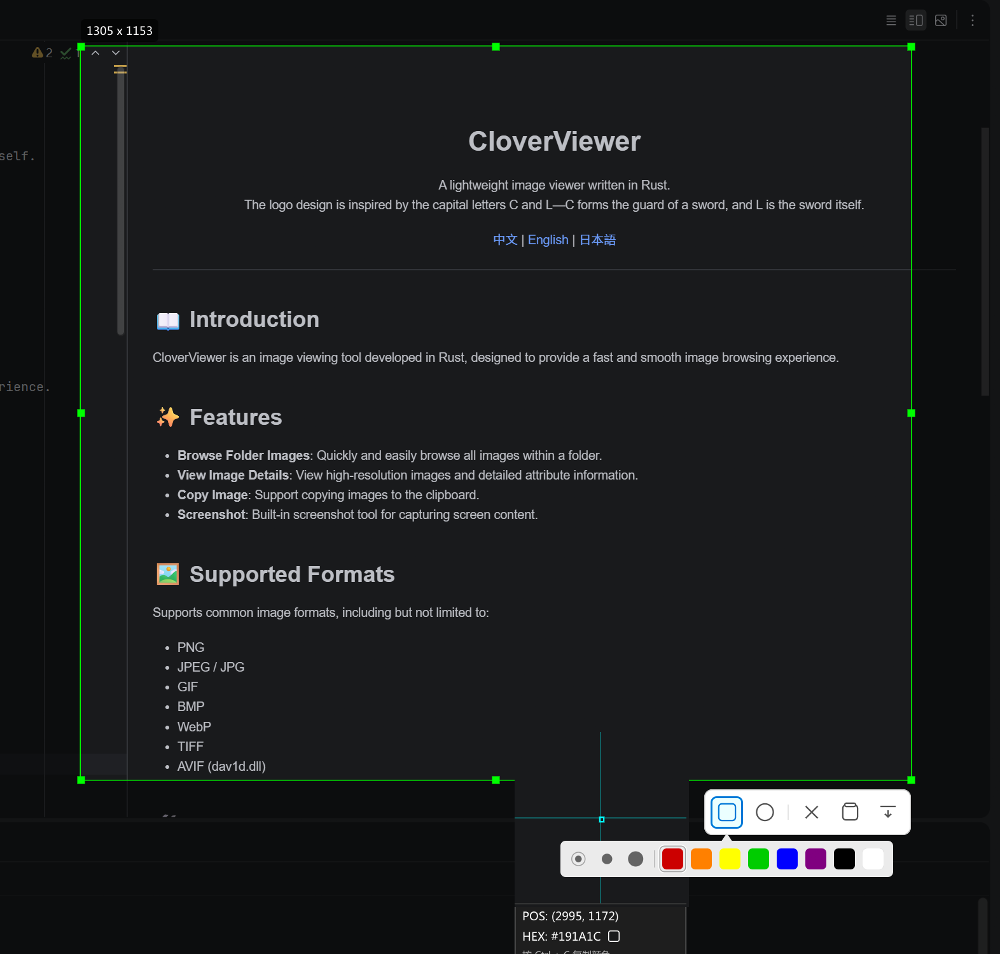

<div align="center">
  
  <h1>CloverViewer Image Viewer & Screenshot Tool</h1>
  <p>
    A lightweight image viewer and screenshot tool written in Rust.<br>
    The logo design is inspired by the capital letters C and L—C forms the guard of a sword, and L is the sword itself.
  </p>
  <p>
    <a href="README.md">中文</a> | <a href="README.en.md">English</a> | <a href="README.ja.md">日本語</a>
  </p>
</div>

---

## 📖 Introduction

CloverViewer is a lightweight tool developed in Rust, combining image browsing and screen capturing capabilities, designed to provide a fast and smooth user experience.

## ✨ Features

### 🖼️ Image Viewer

*   **Dual View Modes**: Switch between Grid view (thumbnails) and Single view (full image)
*   **Folder Browsing**: Automatically load all images when opening a folder
*   **Quick Navigation**: Use Left/Right arrow keys to switch images quickly
*   **Smooth Zooming**: Mouse wheel zoom with customizable sensitivity
*   **Drag & Drop**: Open images or folders by dragging them into the window
*   **Image Properties**: View detailed information (name, date, path, dimensions)
*   **Context Menu**: Copy image, copy path, view properties
*   **Clipboard Integration**: One-click copy image to clipboard

### 📸 Screenshot Tool

*   **Multi-Monitor Support**: Automatically detect and support screenshots across multiple displays
*   **Area Selection**: Freely select the screenshot region
*   **Annotation Tools**:
    *   Rectangle and circle shapes
    *   Arrow annotations
    *   Freehand pencil drawing
    *   Mosaic blur
    *   Text annotations
*   **OCR Text Recognition**: Based on Windows native OCR engine, extract text from images with one click
*   **Magnifier**: Real-time display of mouse position coordinates and color value, support Ctrl+C to copy color
*   **Color Picker**: Long-press tool icon to open color palette, customize drawing colors
*   **Undo**: Ctrl+Z to undo the last drawing operation
*   **Quick Save**: Save to desktop or copy directly to clipboard

### ⚙️ System Features

*   **System Tray**: Option to minimize to system tray when closing window
*   **Global Hotkeys**:
    *   Default Alt+S to quickly start screenshot
    *   Support custom hotkeys
    *   Global hotkeys that work even when minimized to tray
*   **Multi-language Support**: Chinese, English, and Japanese interfaces
*   **Settings Panel**: Visual configuration for language, hotkeys, magnifier, and more

## 📸 Screenshots

|                              Grid Mode                               |                             Detail Mode                              |
|:--------------------------------------------------------------------:|:--------------------------------------------------------------------:|
|           |         |
|                        **Screenshot Mode 1**                         |                        **Screenshot Mode 2**                         |
|  |  |

## 🖼️ Supported Formats

Supports common image formats:
*   PNG
*   JPEG / JPG
*   GIF
*   BMP
*   WebP
*   TIFF
*   ~~AVIF~~ (requires dav1d.dll, currently not enabled)

## 🛠️ Development Environment Setup

Make sure you have the [Rust](https://www.rust-lang.org/tools/install) toolchain installed, then run the following command to build the project:

```shell
cargo build --release
```

## ⌨️ Keyboard Shortcuts

### Image Viewer

| Shortcut | Function |
|----------|----------|
| ← | Previous image |
| → | Next image |
| Scroll Wheel | Zoom image |

### Screenshot Tool

| Shortcut | Function |
|----------|----------|
| Alt+S (customizable) | Start screenshot |
| Esc | Exit screenshot |
| Ctrl+Z | Undo last drawing |
| Ctrl+C | Copy color value (when magnifier is enabled) |

## 🤝 Acknowledgements

Special thanks to **Gemini AI** for the valuable assistance provided during the development of this project.

## 📄 License

This project is licensed under the [MIT License](LICENSE).
